# 👋 Hi, I'm Riyan Pratama

Cybersecurity professional specializing in SOC leadership, threat hunting, cyber threat intelligence, and attack surface management. I build efficient, intelligence-driven security operations that go beyond alert monitoring to deliver real-world threat mitigation.

> *"Cybersecurity is more than tools — it's a strategy."*

---

## 🌐 Connect with Me

[](https://linkedin.com/in/administratorpanel)
[](https://sudo3rs.medium.com/)
[](https://bsky.app/profile/sudo3rs)
[](https://x.com/sudo3rs)
[](https://discord.gg/sudo3rs)
[](https://youtube.com/@sudo3rs)
[](mailto:sudo3rs)

---

## 🛡️ Expertise

- **Threat Hunting & Incident Analysis** — Identify hidden threats and attacker behavior *before* incidents escalate
- **SOC Strategy & Development** — Design efficient SOC frameworks to improve detection, response, and operations
- **Cyber Threat Intelligence & OSINT** — Turn intelligence into actionable insights for decisions and adversary tracking
- **Cloud Security & Attack Surface Management** — Secure cloud environments, reduce misconfigurations, minimize exposure
- **Security Automation & Process Optimization** — Use automation and analytics to boost efficiency and reduce false positives

---

## 💻 Tech Stack

### Languages


### Frameworks & Libraries


### Infrastructure & DevOps


### Security & Monitoring


### Tools & Platforms


### Data Science & ML


### Design


---

## 🧭 Open-Source Projects

| Project | Description |
|---------|-------------|
| **[MacFIRE](https://github.com/Masriyan/MacFIRE)** | macOS DFIR collection & imaging toolkit: timeline, memory, rootkit checks, HTML reporting |
| **[Aegis](https://github.com/Masriyan/Aegis)** | Windows-friendly single-file Python web app for URL recon, OSINT enrichment, subdomain intel |
| **[ExpertXSS](https://github.com/Masriyan/ExpertXSS)** | Python XSS scanner that fetches the latest payloads automatically |
| **[ExpertRecon](https://github.com/Masriyan/ExpertRecon)** | Recon & exploitation helper integrating multi-tech discovery and third-party APIs |
| **[No-Secret-Scan](https://github.com/Masriyan/No-Secret-Scan-)** | Find exposed secrets / hard-coded credentials in web pages |
| **[No-Secret-Scan for GitHub/GitLab](https://github.com/Masriyan/No-Secret-Scan-Github-Gitlab)** | Scan repos for API keys and tokens across history |
| **[uclsoc_code](https://github.com/Masriyan/uclsoc_code)** | Curated SIEM detection logic library mapped by domain & framework |
| **[Kalitellingence](https://github.com/Masriyan/Kalitellingence)** | One-shot Kali setup for Threat Intel & dark-web workflows |

---

## 📈 Workflow Diagrams

### Threat Hunting Workflow

```mermaid
flowchart TD
  A["Collect Signals"] --> B["Enrich: WHOIS · OSINT · VT · Shodan"]
  B --> C["Detect and Correlate: SIEM rules · UEBA"]
  C --> D{"Suspicious"}
  D -- "Yes" --> E["Hunt Loop: pivot → query → timeline"]
  D -- "No"  --> H["Autoclose and Tune Rules"]
  E --> F["Triage and Contain"]
  F --> G["Incident Response: Mitigate and Eradicate"]
  G --> I["Lessons Learned"]
  I --> J["Automate: SOAR XSOAR · scripts"]
  J --> C
```


### Repo Ecosystem


---

## 📌 Pinned Repositories

<div align="center">
  <a href="https://github.com/Masriyan/MacFIRE">
    
  </a>
  <a href="https://github.com/Masriyan/Aegis">
    
  </a>
</div>
<div align="center">
  <a href="https://github.com/Masriyan/ExpertXSS">
    
  </a>
  <a href="https://github.com/Masriyan/ExpertRecon">
    
  </a>
</div>

---

## 📊 GitHub Stats

<div align="center">
  
  
</div>

<div align="center">
  
</div>

---

## 🏆 GitHub Trophies

<div align="center">
  
</div>

---

## 🔧 Skills Overview

```text
🔐 Security          ██████████████████████░░   90%
🕵️ Threat Hunting    ██████████████████████░░   90%
🛡️ SIEM              █████████████████████░░░   85%
🔍 OSINT             ████████████████████░░░░   80%
🧪 Incident Response █████████████████████░░░   85%
🖥️ Network Security  ████████████████████░░░░   80%
```

---

## 👨‍🌾 Fun Facts

- Owner of **Wedusku Farm** (goat farmer 🐐)
- Expert in *ngarit* (traditional grass cutting for animal feed)
- I build security solutions while nurturing my farm

---

## 💰 Support My Work

[](https://paypal.me/riyansuryapratama)

---

<div align="center">
  
  <p>Thanks for visiting! 🙌</p>
</div>
