```mermaid
%%{init: {'theme': 'dark', 'themeVariables': { 'primaryColor': '#F85149', 'primaryTextColor': '#C9D1D9', 'primaryBorderColor': '#30363D', 'lineColor': '#F8D866', 'secondaryColor': '#161B22', 'tertiaryColor': '#0D1117'}}}%%
flowchart LR
    A[📡 Collect] --> B[🔍 Enrich]
    B --> C[⚡ Correlate]
    C --> D{🎯 Threat?}
    D -->|Yes| E[🔬 Hunt]
    D -->|No| F[✅ Tune]
    E --> G[🛡️ Contain]
    G --> H[📝 Report]
    H --> I[🤖 Automate]
    I --> C
```

<!-- HEADER WITH ANIMATED GRADIENT -->


<!-- ANIMATED TYPING SVG -->
<div align="center">
  
# ⚔️ RIYAN PRATAMA

<a href="https://git.io/typing-svg"></a>

<br/>

<!-- SOCIAL BADGES WITH ICONS -->
<a href="https://linkedin.com/in/administratorpanel"></a>
<a href="https://sudo3rs.medium.com/"></a>
<a href="https://x.com/sudo3rs"></a>
<a href="http://www.security-life.org"></a>

<br/><br/>

<!-- QUOTE -->


</div>

---

<!-- ABOUT SECTION WITH GIF -->


### 🎯 About Me

```yaml
name: Riyan Pratama
alias: sudo3rs
role: Threat Hunter & Security Researcher
location: Indonesia 🇮🇩
focus:
  - Threat Hunting & Incident Analysis
  - SOC Strategy & Development  
  - Cyber Threat Intelligence
  - Attack Surface Management
  - Security Automation
fun_fact: "I run Wedusku Farm 🐐"
```

<br clear="right"/>

---

<!-- GITHUB STATS -->
<h2 align="center">📊 GitHub Analytics</h2>

<p align="center">
<a href="https://github.com/Masriyan">
  
  
</a>
</p>

<p align="center">
  
</p>

---

<!-- REPOSITORY ARSENAL -->
<h2 align="center">🛡️ Security Arsenal</h2>

<p align="center"><i>Open-source tools sorted by ⭐ stars</i></p>

<div align="center">

| ⭐ | Project | Description | Stack |
|:---:|:--------|:------------|:-----:|
| **6** | [**MacFIRE**](https://github.com/Masriyan/MacFIRE) | macOS DFIR toolkit — forensic acquisition, timeline analysis, rootkit detection, HTML reporting |  |
| **5** | [**uclsoc_code**](https://github.com/Masriyan/uclsoc_code) | SIEM detection library mapped to MITRE ATT&CK framework |  |
| **3** | [**ExpertXSS**](https://github.com/Masriyan/ExpertXSS) | XSS scanner with auto-updating payloads from public sources |  |
| **3** | [**ExpertRecon**](https://github.com/Masriyan/ExpertRecon) | Recon & exploitation tool integrating third-party APIs |  |
| **1** | [**Aegis**](https://github.com/Masriyan/Aegis) | Single-file web app for URL recon & OSINT enrichment |   |
| **1** | [**No-Secret-Scan-**](https://github.com/Masriyan/No-Secret-Scan-) | Detect hardcoded secrets in web pages |  |
| **1** | [**No-Secret-Scan-Github-Gitlab**](https://github.com/Masriyan/No-Secret-Scan-Github-Gitlab) | Scan repos for API keys across git history |  |
| — | [**Kalitellingence**](https://github.com/Masriyan/Kalitellingence) | One-shot Kali setup for Threat Intel workflows |  |

</div>

---

<!-- FEATURED PROJECTS WITH CARDS -->
<h2 align="center">🔥 Featured Projects</h2>

<p align="center">
  <a href="https://github.com/Masriyan/MacFIRE">
    
  </a>
  <a href="https://github.com/Masriyan/uclsoc_code">
    
  </a>
</p>

<p align="center">
  <a href="https://github.com/Masriyan/ExpertXSS">
    
  </a>
  <a href="https://github.com/Masriyan/ExpertRecon">
    
  </a>
</p>

---

<!-- ACTIVITY GRAPH -->
<h2 align="center">📈 Contribution Graph</h2>

<p align="center">
  
</p>

---

<!-- THREAT HUNTING WORKFLOW -->
<h2 align="center">🕵️ Threat Hunting Workflow</h2>



---

<!-- TECH STACK -->
<h2 align="center">💻 Tech Stack</h2>

<p align="center">
  
</p>

---

<!-- TROPHIES -->
<h2 align="center">🏆 GitHub Trophies</h2>

<p align="center">
  
</p>

---

<!-- EXPERTISE -->
<h2 align="center">🎯 Core Expertise</h2>

<div align="center">

|  |  |  |
|:---:|:---:|:---:|
| 🕵️ **Threat Hunting** | 🏛️ **SOC Leadership** | 🌐 **Cyber Threat Intel** |
| Proactive detection | Team building & ops | OSINT & adversary tracking |
| Behavioral analysis | Playbook development | IOC management |
| 🔎 **SIEM Engineering** | ☁️ **Cloud Security** | ⚙️ **Automation** |
| Detection rules | Posture management | SOAR integration |
| Use case library | Asset discovery | Response orchestration |

</div>

---

<!-- FUN SECTION -->
<div align="center">

### 🐐 Fun Fact

```
┌──────────────────────────────────────────────────────────────┐
│                                                              │
│  🌾 By day: Building security solutions                      │
│  🐐 By evening: Tending goats at Wedusku Farm               │
│                                                              │
│  "Security is a process, not a product" — Bruce Schneier    │
│                                                              │
└──────────────────────────────────────────────────────────────┘
```

</div>

---

<!-- SUPPORT & FOOTER -->
<div align="center">

### 💖 Support My Work

<a href="https://paypal.me/riyansuryapratama">
  
</a>

<br/><br/>


<br/>


</div>
