## 🌐 Socials:
[](https://bsky.app/profile/sudo3rs) [](https://behance.net/sudo3rs) [](https://discord.gg/sudo3rs) [](https://facebook.com/sudo3rs) [](https://instagram.com/sudo3rs) [](https://linkedin.com/in/sudo3rs) [](https://medium.com/@sudo3rs) [](https://pinterest.com/sudo3rs) [](https://quora.com/profile/sudo3rs) [](https://reddit.com/user/sudo3rs) [](https://stackoverflow.com/users/sudo3rs) [](https://tiktok.com/@sudo3rs) [](https://twitch.tv/sudo3rs) [](https://x.com/sudo3rs) [](https://youtube.com/@sudo3rs) [](https://codepen.io/sudo3rs) [](https://mastodon.social/@sudo3rs) [](mailto:sudo3rs) 

# 💻 Tech Stack:
                                        
# 📊 GitHub Stats:
<br/>
<br/>


## 🏆 GitHub Trophies


### ✍️ Random Dev Quote


### 🔝 Top Contributed Repo


---
[](https://visitcount.itsvg.in)

  ## 💰 You can help me by Donating
  [](https://paypal.me/riyansuryapratama) 


## 🔐 About Me

Cybersecurity professional specializing in SOC leadership, threat hunting, cyber threat intelligence, and attack surface management. I build efficient, intelligence-driven security operations that go beyond alert monitoring to deliver real-world threat mitigation.

> *"Cybersecurity is more than tools — it’s a strategy."*

---

## 🧭 Open-Source Highlights

- **[MacFIRE](https://github.com/Masriyan/MacFIRE)** — macOS DFIR collection & imaging toolkit: timeline, memory, rootkit checks, HTML reporting.
- **[Aegis](https://github.com/Masriyan/Aegis)** — Windows-friendly single-file Python web app for URL recon, OSINT enrichment, subdomain intel, history & exports.
- **[ExpertXSS](https://github.com/Masriyan/ExpertXSS)** — Python XSS scanner that fetches the latest payloads automatically.
- **[ExpertRecon](https://github.com/Masriyan/ExpertRecon)** — Recon & exploitation helper integrating multi-tech discovery and third-party APIs.
- **[No-Secret-Scan](https://github.com/Masriyan/No-Secret-Scan-)** — Find exposed secrets / hard-coded credentials in web pages.
- **[No-Secret-Scan for GitHub/GitLab](https://github.com/Masriyan/No-Secret-Scan-Github-Gitlab)** — Scan repos for API keys and tokens across history.
- **[uclsoc_code](https://github.com/Masriyan/uclsoc_code)** — Curated SIEM detection logic library mapped by domain & framework.
- **[Kalitellingence](https://github.com/Masriyan/Kalitellingence)** — One-shot Kali setup for Threat Intel & dark-web workflows.

---

## 🧑‍💻 Programming Languages

<p align="left">
  <a href="https://www.python.org/" target="_blank" rel="noreferrer">
    
  </a>
  <a href="https://www.php.net/" target="_blank" rel="noreferrer">
    
  </a>
  <a href="https://developer.mozilla.org/docs/Web/JavaScript" target="_blank" rel="noreferrer">
    
  </a>
  <a href="https://tailwindcss.com/" target="_blank" rel="noreferrer">
    
  </a>
</p>

## ⚙️ Frameworks & Libraries

<p align="left">
  <a href="https://flask.palletsprojects.com/" target="_blank" rel="noreferrer">
    
  </a>
  <a href="https://fastapi.tiangolo.com/" target="_blank" rel="noreferrer">
    
  </a>
  <a href="https://laravel.com/" target="_blank" rel="noreferrer">
    
  </a>
  <a href="https://expressjs.com/" target="_blank" rel="noreferrer">
    
  </a>
  <a href="https://alpinejs.dev/" target="_blank" rel="noreferrer">
    
  </a>
  <a href="https://tailwindcss.com/" target="_blank" rel="noreferrer">
    
  </a>
</p>

---

## 🛡️ Expertise

- **Threat Hunting & Incident Analysis** — Identify hidden threats and attacker behavior *before* incidents escalate.
- **SOC Strategy & Development** — Design efficient SOC frameworks to improve detection, response, and operations.
- **Cyber Threat Intelligence & OSINT** — Turn intelligence into actionable insights for decisions and adversary tracking.
- **Cloud Security & Attack Surface Management** — Secure cloud environments, reduce misconfigurations, minimize exposure.
- **Security Automation & Process Optimization** — Use automation and analytics to boost efficiency and reduce false positives.

---

## 📈 Visuals (Mermaid)

> GitHub tip: use quoted labels like `A["Text"]` to avoid parser errors with special characters.

### Tech Stack at a Glance


### Threat Hunting Workflow

```mermaid
flowchart TD
  A["Collect Signals"] --> B["Enrich: WHOIS · OSINT · VT · Shodan"]
  B --> C["Detect and Correlate: SIEM rules · UEBA"]
  C --> D{"Suspicious"}
  D -- "Yes" --> E["Hunt Loop: pivot → query → timeline"]
  D -- "No"  --> H["Autoclose and Tune Rules"]
  E --> F["Triage and Contain"]
  F --> G["Incident Response: Mitigate and Eradicate"]
  G --> I["Lessons Learned"]
  I --> J["Automate: SOAR XSOAR · scripts"]
  J --> C
```


### Project Roadmap (Illustrative)


### Repo Ecosystem Map


---

## 📌 Pinned Repositories

<div align="center">
  <a href="https://github.com/Masriyan/MacFIRE" rel="noreferrer">
    
  </a>
  <a href="https://github.com/Masriyan/Aegis" rel="noreferrer">
    
  </a>
  <a href="https://github.com/Masriyan/ExpertXSS" rel="noreferrer">
    
  </a>
  <a href="https://github.com/Masriyan/ExpertRecon" rel="noreferrer">
    
  </a>
  <a href="https://github.com/Masriyan/No-Secret-Scan-" rel="noreferrer">
    
  </a>
  <a href="https://github.com/Masriyan/No-Secret-Scan-Github-Gitlab" rel="noreferrer">
    
  </a>
</div>

---

## 📊 GitHub Stats

<div align="center">
  <a href="https://github.com/Masriyan" rel="noreferrer">
    
    
  </a>
</div>

<div align="center">
  
</div>

---

## 🔧 Skills & Tools

```text
🔐 Security          ██████████████████████░░   90%
🕵️ Threat Hunting    ██████████████████████░░   90%
🛡️ SIEM              █████████████████████░░░   85%
🔍 OSINT             ████████████████████░░░░   80%
🧪 Incident Response █████████████████████░░░   85%
🖥️ Network Security  ████████████████████░░░░   80%
```

---

## 📫 Connect with Me

<div align="center">
  <a href="https://www.linkedin.com/in/administratorpanel" target="_blank" rel="noreferrer">
    
  </a>
  <a href="https://sudo3rs.medium.com/" target="_blank" rel="noreferrer">
    
  </a>
</div>

---

## 👨‍🌾 Fun Facts

- Owner of **Wedusku Farm** (goat farmer 🐐)
- Expert in *ngarit* (traditional grass cutting for animal feed)
- I build security solutions while nurturing my farm

---

<div align="center">
  
  <p>Thanks for visiting my profile! Have a nice day! 🙌</p>
</div>
